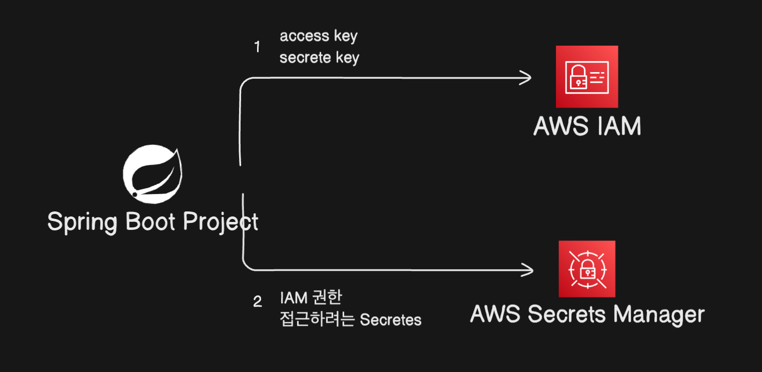

# AWS Secretmanager를 이용하여 환경변수 설정

`DB 아이디, 비밀번호` `secret key` 등 민감한 속성들은 프로젝트 안에 있으면 위험합니다.(다른 사람이 해당 속성을 얻어 악용할 우려)      
`github`에서 `private repository`라도 안전하지 않습니다.(모든 조직원이 시크릿 정보에 접근 가능)   
그래서 시크릿 속성은 따로 공개되지 않은 안전한 장소에 저장해두어야 합니다.   

## 어디에 저장해둘까?
 

프로젝트는 `intellij`와 같은 로컬 ide에서 작업되어 `github`에 저장됩니다.   
이후 특정 시점에 `github`의 코드 또는 도커 이미지를 `aws`로 옮깁니다.

## 저장해둘 곳

1. Github Secrets   
- 안전하지만, github에 종속적입니다. 실제 사용할 곳은 aws인데, github도 정보를 알고 있어야 합니다.
2. AWS SecretManager
- 사용할 장소와 저장할 장소가 일치합니다. 별 이유가 없다면 aws에 저장해두고 사용하는 것이 바람직합니다.

## AWS SecretManager 흐름

## 구현 방법

1. `SecretManager` 접근 권한이 있는 `IAM Key` 발급 
2. `AWS_ACCESS_KEY_ID`, `AWS_SECRET_ACCESS_KEY` 환경 변수로 설정
3. `SecretManager` 의존성 주입
4. 접근 `Secrets` 설정(spring.config.import)
